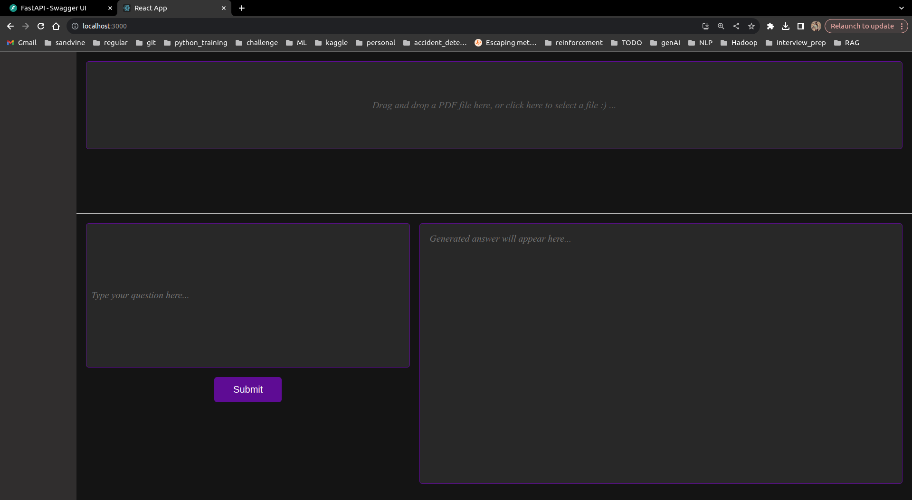
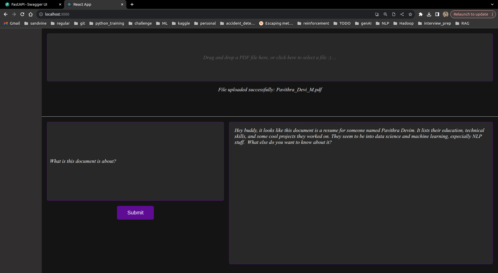
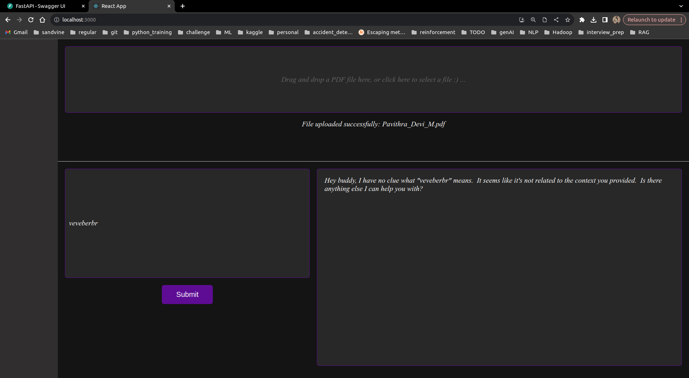

# :sparkles: PDF Question and Answer Application -- you can upload any PDF and ask questions about it.

Developed a containerized web application where users can upload PDFs and ask questions. Integrated a Retrieval-Augmented Generation (RAG) system using LangChain to store document data in a vector database, retrieve relevant information, and feed it to an LLM for answer generation. Built the frontend using React.js.


# :one: | The Application UI:
1. This is a single page web application, looks like this:

2. You can upload any PDF and ask questions about it, The LLM which integrated in the backend will analyze the document and answer your questions.



# :two: | Skills Used :ninja:
- RAG
- LLM
- Python
- Docker
- React JS
- FastAPI

# :three: | How to Use.
- 1. Run the docker containers using the below command:

This will pull the Docker image from the Docker repository and run it.
```
docker run -d --name "noso_api" -p 127.0.0.1:8000:8000  pavithra495/pdf_qa_api
docker run -d --name "noso_ui" -p 127.0.0.1:3000:3000  pavithra495/pdf_qa_ui
```
containers:
```
(gen_ai_projects) pavithra@pmurugesan-lnx1:~/projects/GenAI/Pdf_Q_and_A_Longchain$(git_branch)$ docker ps
CONTAINER ID   IMAGE                    COMMAND       CREATED          STATUS          PORTS                      NAMES
2da2c21237d1   pavithra495/pdf_qa_ui    "/start.sh"   2 seconds ago    Up 2 seconds    127.0.0.1:3000->3000/tcp   noso_ui
9231dc8ee377   pavithra495/pdf_qa_api   "/start.sh"   18 seconds ago   Up 17 seconds   127.0.0.1:8000->8000/tcp   noso_api
(gen_ai_projects) pavithra@pmurugesan-lnx1:~/projects/GenAI/Pdf_Q_and_A_Longchain$(git_branch)$
```
- 2. Now you can go to **localhost:3000** to see the Web page and start interacting.

# :four: | Places to improve :arrow_up:
-  Make a mechanism to upload more document at the same time.
-  Improve logging for better error handling.
- For UI, I can add the loading indicator when I submit a question.
